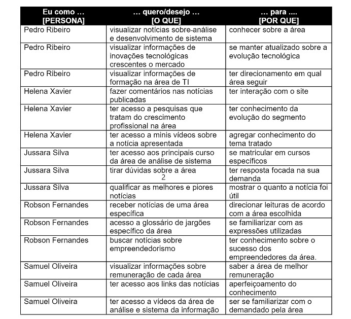
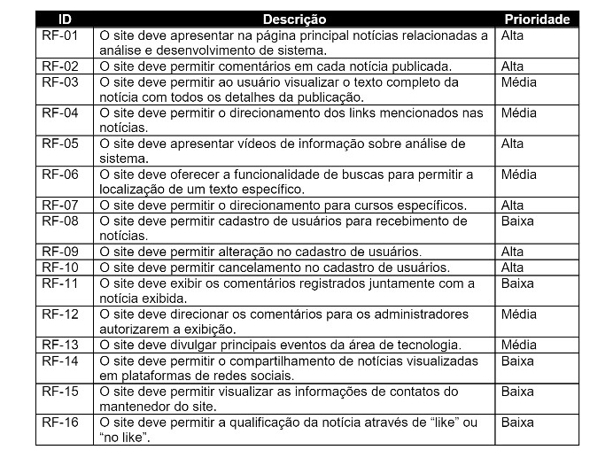
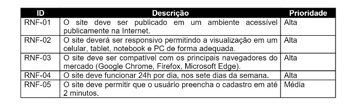
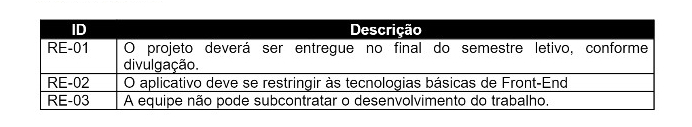

# Especificações do Projeto

 A definição no qual se baseia o problema levantado nesse projeto, foi considerado com base nas necessidades dos usuários retratados pelos membros da equipe e detalhados em forma de persona e histórias de usuários.

## Personas

 A definição no qual se baseia o problema levantado nesse projeto, foi considerado com base nas necessidades dos usuários retratados pelos membros da equipe e detalhados em forma de persona e história de usuários.

## Histórias de Usuários

 A partir da compreensão das necessidades das personas identificadas para o projeto, foram registradas as seguintes histórias de usuários.

## Requisitos

### Requisitos Funcionais
A tabela a seguir apresenta os requisitos do projeto, identificando a prioridade em que os mesmos devem ser entregues.

### Requisitos não Funcionais
 A tabela a seguir apresenta os requisitos não funcionais que o projeto deverá atender.

## Restrições
As questões que limitam a execução desse projeto e que se configuram como obrigações claras para o desenvolvimento do projeto em questão são apresentadas na tabela a seguir.

## Referências
A lista a seguir traz as referências utilizadas nesse trabalho. são elas: 
https://www.advanceconsulting.com.br/pesquisa#:~:text=Segundo%20pesquisa%20feita%20pela%20ADVANCE,vendendo%20tudo%20o%20que%20poderia.

https://brasscom.org.br/estudo-da-brasscom-aponta-demanda-de-797-mil-profissionais-de-tecnologia-ate-2025/

https://www.profissionaisti.com.br/a-dificuldade-do-primeiro-emprego-no-mercado-de-ti/

