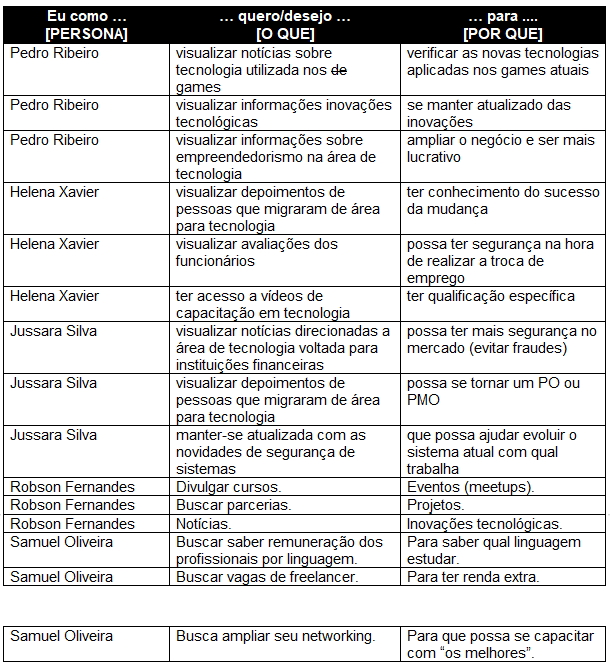
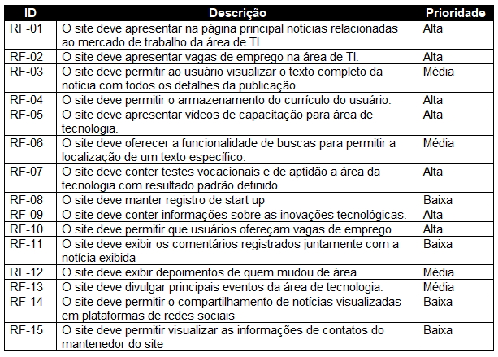
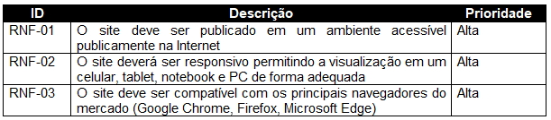

# Especificações do Projeto

 A definição no qual se baseia o problema levantado nesse projeto, foi considerado com base nas necessidades dos usuários retratados pelos membros da equipe e detalhados em forma de persona e história de usuários.

## Personas

A definição no qual se baseia o problema levantado nesse projeto, foi considerado com base nas necessidades dos usuários retratados pelos membros da equipe e detalhados em forma de persona e história de usuários.

## Histórias de Usuários

A partir da compreensão das necessidades das personas identificadas para o projeto, foram registradas as seguintes histórias de usuários.

## Requisitos

A tabela a seguir apresenta os requisitos do projeto, identificando a prioridade em que os mesmos devem ser entregues.

### Requisitos Funcionais

### Requisitos não Funcionais

## Restrições

As questões que limitam a execução desse projeto e que se configuram como obrigações claras para o desenvolvimento do projeto em questão são apresentadas na tabela a seguir.

