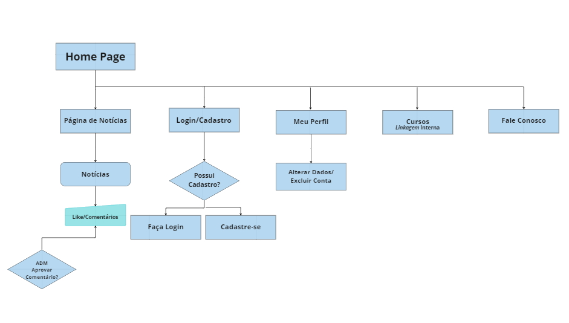

# Projeto de Interface

Dentre as preocupações para a montagem da interface do sistema, estamos estabelecendo foco em questões como agilidade, acessibilidade e usabilidade. Desta forma, o projeto tem uma identidade visual padronizada em todas as telas que são projetadas para funcionamento em desktops e dispositivos móveis.

## User Flow - Fluxo de Usuário
 Visando garantir a fluidez do site, elaboramos um fluxo de usuário auto intuitivo, onde o usuário terá facilidade em navegar sobre os temas bem definidos.

## Wireframes
São protótipos usados em design de interface para sugerir a estrutura de um site web e seu relacionamentos entre suas páginas. Um wireframe web é uma ilustração semelhante do layout de elementos fundamentais na interface.

## Tela Inicial - Home Page

## Tela de Notícias

## Tela de Guias e Materias de Estudo

## Tela de Vagas/Oportunidades de Emprego

## Tela de Login

## Tela de Cadastro de Usuário

## Tela de Perfil de Usuário

