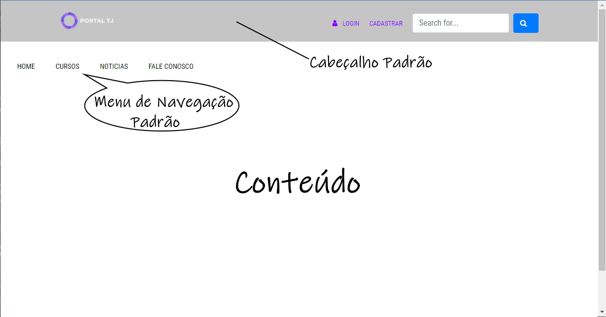
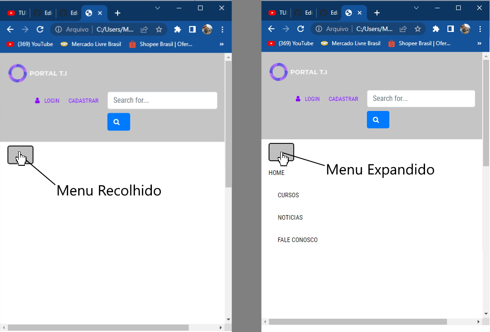

# Template padrão do site
 Layout padrão do site (HTML e CSS) que será utilizado em todas as páginas com a definição de identidade visual, aspectos de responsividade e iconografia.

 O padrão de layout a ser utilizado pelo site tem correspondência ao projeto de Interface elaborado anteriormente.
 ## Layout Padrão:

 Este é o template padrão e suas cores a serem utilizadas para todo o site, nas demais abas respectivamente.

 O layout do site foi elaborado aplicando a responssividade, que reorganiza os elementos do site para telas menores ou janelas redimensionadas para um tamanhho menor. 
 Veja:
 

 As cores de fundo/cabeçalho, logo marca, menu de navegação e cores das fontes devem ser seguidas e mantidas conforme exposto no layout padrão.
