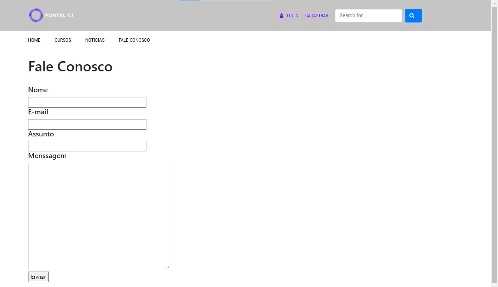

# Programação de Funcionalidades

Pré-requisitos: <a href="2-Especificação do Projeto.md"> Especificação do Projeto</a>, <a href="3-Projeto de Interface.md"> Projeto de Interface</a>, <a href="4-Metodologia.md"> Metodologia</a>, <a href="3-Projeto de Interface.md"> Projeto de Interface</a>, <a href="5-Arquitetura da Solução.md"> Arquitetura da Solução</a>

Implementação do sistema descritas por meio dos requisitos funcionais e/ou não funcionais. Deve relacionar os requisitos atendidos os artefatos criados (código fonte) além das estruturas de dados utilizadas e as instruções para acesso e verificação da implementação que deve estar funcional no ambiente de hospedagem.

Para cada requisito funcional, pode ser entregue um artefato desse tipo
 # André Azevedo Ferreira Carvalho:
 Realizei a criação do menu de navegação presente em todas as paginas e o mecanismo de busca (<a href="https://github.com/ICEI-PUC-Minas-PMV-ADS/pmv-ads-2022-2-e1-proj-web-t5-portal-ti-informa/blob/Site-beta/mecanismo de buxca.html"> Exemplificado na aba de mecanismo de busca</a>). Foi utilizado a linguagem HTML com suporte do Java para o funcionamento da busca
  - Requisito funcional atendido: RF-06 O site deve permitir visualizar as informações de contato
do mantedor do site.

- Link do código fonte da aba (<a href="https://github.com/ICEI-PUC-Minas-PMV-ADS/pmv-ads-2022-2-e1-proj-web-t5-portal-ti-informa/blob/Site-beta/mecanismo de buxca.html">  mecanismo de busca</a>)

- Link do código fonte do arquivo externo .js:https://github.com/ICEI-PUC-Minas-PMV-ADS/pmv-ads-2022-2-e1-proj-web-t5-portal-ti-informa/blob/Site-beta/js/script.js
- 

 # Marlon Sttefane Guimarães Silva:
 Realizei a criação da aba 'Fale Conosco'. Foi utilizado a linguagem HTML com suporte do PHP para envio e salvamento do formulário.
 Por enquanto o arquivo .php não será utilizado, porque precisamos de um servidor hospedeiro para o site funcionar com o php e não o temos. Sendo assim, coloquei para salvar os dados do formulário em uma planilha na web, fornecida pelo Sheet Monkey em parceria com o Google Sheets, por meio de uma api.
 Link do Sheet Monkey: https://sheetmonkey.io/
 
- Requisito funcional atendido: RF-15 o que um site deve oferecer a funcuibakudade de busca para permitir a localização de um text especifico.
 

- Link do código fonte da aba Fale Conosco: https://github.com/ICEI-PUC-Minas-PMV-ADS/pmv-ads-2022-2-e1-proj-web-t5-portal-ti-informa/blob/Site-beta/faleconosco.html

- Link do código fonte do arquivo externo .php: https://github.com/ICEI-PUC-Minas-PMV-ADS/pmv-ads-2022-2-e1-proj-web-t5-portal-ti-informa/blob/Site-beta/form_Faleconosco.php
(Não usado no momento por falta de um servidor hospedeiro. Foi substituido no momento por uma planilha do Sheet Monkey/google Sheets)

# Leonardo Rodrigues Barbosa Maia:

Iniciei criando a funcionalidade de mudança de tema (white mode ou dark mode). Usando HTML, CSS e javascript. Porém, tive dificuldades em fazer o menu se tornar 100% funcional utilizando as 3 tecnologias. Estou procurando uma melhor forma de executar e entregar até a proxima etapa.
a seguir a imagem da pagina como um todo, com atenção ao menu do tema dark, white mode, no canto direito:

logo em seguida a destaque para o menu de dark, white mode:

> **Links Úteis**:
>
> - [Trabalhando com HTML5 Local Storage e JSON](https://www.devmedia.com.br/trabalhando-com-html5-local-storage-e-json/29045)
> - [JSON Tutorial](https://www.w3resource.com/JSON)
> - [JSON Data Set Sample](https://opensource.adobe.com/Spry/samples/data_region/JSONDataSetSample.html)
> - [JSON - Introduction (W3Schools)](https://www.w3schools.com/js/js_json_intro.asp)
> - [JSON Tutorial (TutorialsPoint)](https://www.tutorialspoint.com/json/index.htm)
